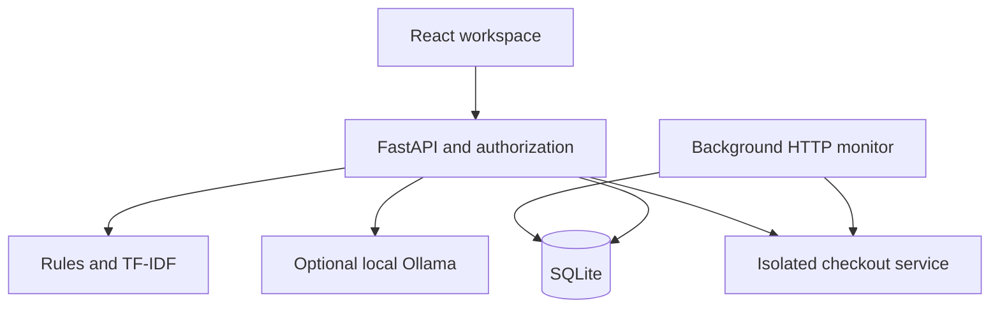

# ResolveIQ v2

**An evidence-led incident workspace with team access and live local monitoring.**

React · FastAPI · SQLite · HTTP monitoring · TF-IDF retrieval · Optional Ollama

ResolveIQ connects incident investigation with a demonstrable operational workflow: deliberately fail an isolated checkout service, detect the failure through real HTTP probes, investigate the captured logs, restore service health, and record a human-reviewed resolution.

## Quick start

Extract the archive, open the `resolveiq` folder in VS Code, and run `start_windows.bat`. Open **http://127.0.0.1:8000** and create an administrator using the first-run setup code printed in the terminal. Python 3.11+ and initial internet access for package installation are required. A compiled React frontend is included.

**Existing users: read [START_HERE.md](START_HERE.md) before upgrading.** Back up the old project and copy its `data` folder only after stopping the old server. The additive schema migration preserves incidents and history.

## Features

- Administrator bootstrap with a random terminal-only setup code; no shared default credentials.
- Local login/logout, salted scrypt password hashes, expiring HttpOnly session cookies, CSRF validation, origin checks, and persistent login throttling.
- Admin, Engineer, and Viewer roles enforced on API endpoints; assignment to active engineers, account deactivation, and session revocation.
- Incident creation, search, status filters, five explainable error families, log-line evidence, similarity retrieval, resolution notes, and JSON export.
- Optimistic version checks reject stale concurrent edits instead of silently overwriting them.
- A separate synthetic checkout HTTP service with healthy, database-failure, and memory-failure scenarios.
- Background checks every five seconds; two-failure threshold, incident deduplication, bounded history, availability and latency views, and recovery events.
- Human closure of monitored incidents requires a recent successful probe.
- Optional local language-model explanations through Ollama, generated only when requested and labeled for human review.
- Incident activity and administrator-visible workspace audit history.

## Roles

| Action | Admin | Engineer | Viewer |
|---|---|---|---|
| Read incidents, health, team list, export JSON | Yes | Yes | Yes |
| Create, assign, update, resolve incidents | Yes | Yes | No |
| Trigger demo scenarios / request enabled AI explanation | Yes | Yes | No |
| Create users / update other accounts / view workspace audit | Yes | No | No |
| Pause and resume monitoring | Yes | No | No |
| Change own password | Yes | Yes | Yes |

One shared workspace, not multi-tenant isolation. All members can read all workspace incidents. API permission checks do not rely on hidden UI buttons.

## Architecture



`run.py` starts the demo on port 8010 and the workspace on 8000, both bound to localhost. A shared random token protects demo control requests. A fixed probe URL avoids exposing an arbitrary URL-fetching endpoint. The monitor creates and updates incidents transactionally. SQLite uses WAL and foreign keys. One application process is supported; do not use multiple Uvicorn workers with the in-process monitor.

## Analysis and AI

The deterministic detector covers database connectivity, memory exhaustion, upstream timeouts, authentication errors, and disk exhaustion. Matches remain hypotheses. TF-IDF with log-scaled term frequency and smoothed IDF ranks resolved incidents by cosine similarity, excluding the incident under investigation. Scores are similarity, not accuracy or calibrated confidence. The 0.08 cutoff is a demo heuristic.

Optional Ollama explanations send bounded matched evidence and rule guidance to a local model. There is no tool execution or automatic remediation. Generated text may contain unsupported conclusions or citations; a person must review it. Rules and retrieval do not require Ollama. See the optional setup instructions in START_HERE.md.

## Source layout

| Path | Responsibility |
|---|---|
| `backend/auth.py` | Password hashes, bootstrap, sessions, CSRF, authentication |
| `backend/storage.py` | Database access and additive migrations |
| `backend/main.py` | Incident, team, monitor, and AI APIs; permissions and validation |
| `backend/monitoring.py` | HTTP probes, deduplication, recovery, check retention |
| `backend/demo_service.py` | Isolated controllable HTTP service |
| `backend/analysis.py` | Error rules, limited secret masking, TF-IDF |
| `frontend/src/Account.jsx` | Setup and sign-in |
| `frontend/src/Advanced.jsx` | Monitoring, teams, optional AI interface |
| `frontend/src/main.jsx` | Incident workflow |
| `run.py` | Start/stop both services |
| `tests/test_project.py` | Functional, permission, and migration checks |

## Verification

```bash
python -m pip install -r requirements-dev.txt
python -m pytest -q
cd frontend
npm ci
npm run build
```

See [docs/VALIDATION.md](docs/VALIDATION.md) for the actual execution results and limitations. Tests use temporary databases. CI runs backend tests and a frontend production build. Synthetic tests do not establish real-world diagnostic accuracy or production SLA.

## Security and operational limits

Passwords use salted scrypt (N=32768, r=8, p=3), an OWASP-listed work-factor configuration. Session tokens are random and stored as hashes; cookies are HttpOnly and SameSite=Strict. On localhost HTTP, Secure cookies are off; a future HTTPS deployment must set `RESOLVEIQ_COOKIE_SECURE=1`. Logout, deactivation, role changes, and password changes revoke relevant sessions. No password, session, or control token is shipped in the archive.

This is a portfolio/local team edition, not a security-audited production service. There is no MFA, email invitation/reset flow, multi-tenant isolation, TLS deployment, distributed monitor, immutable audit storage, real external service integration, or full secret scanner. Common-secret masking is best-effort. Availability reports only retained probe outcomes. The database and incident collections are intended for small workloads. Do not expose it publicly by changing host bindings without a deployment review.

## GitHub preparation

Do not upload `data/`, `.venv/`, `node_modules/`, real logs, passwords, or tokens. `.gitignore` excludes runtime data. The compiled frontend is intentionally tracked for easy startup. Add your own screenshots and demo video after running v2. See [docs/INTERVIEW_GUIDE.md](docs/INTERVIEW_GUIDE.md).

```bash
git init
git add .
git commit -m "Build ResolveIQ v2 with team roles and live demo monitoring"
git branch -M main
git remote add origin YOUR_REPOSITORY_URL
git push -u origin main
```

Replace YOUR_REPOSITORY_URL with your own empty repository URL. GitHub Pages alone cannot run the Python backend.

## References

- [OWASP password storage guidance](https://cheatsheetseries.owasp.org/cheatsheets/Password_Storage_Cheat_Sheet.html)
- [Ollama API documentation](https://docs.ollama.com/api)

Developed with AI assistance. Review, run, and modify the implementation before presenting it in interviews; do not claim production deployments, unmeasured accuracy, or hiring guarantees.
